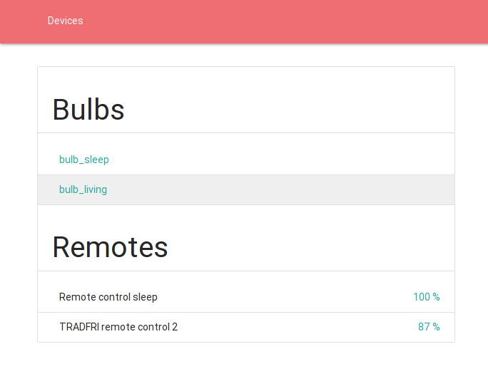
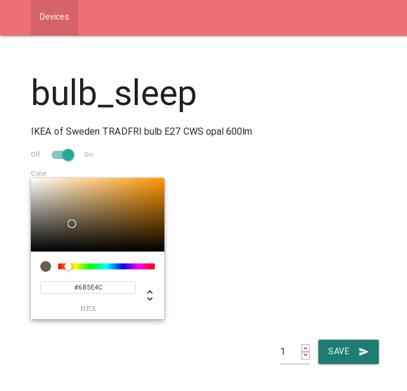
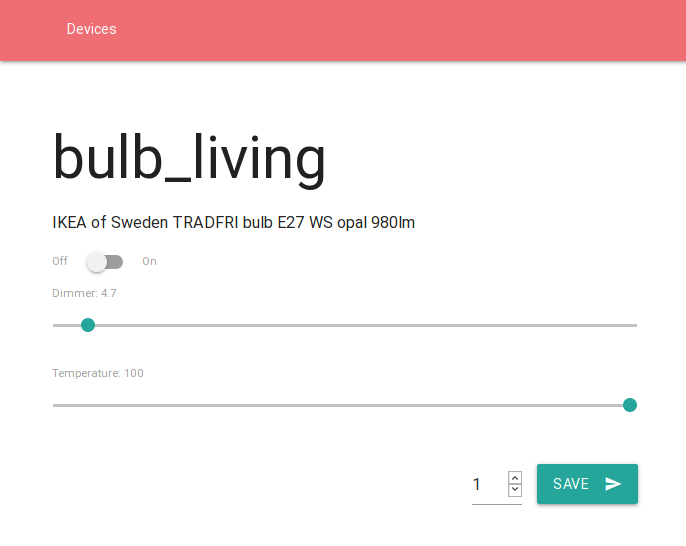

# Tradfri manager

Simple webinterface to manage tradfri light bulbs (or any other devices supporting the COAP protocol).

## Setup

To setup tradfri manager you have to create a `settings.json` file that
contains information about your local tradfri gateway.

```json
{
    "securityCode": "abcedf123456"
}
```

You can find the security code of your tradfri gateway on the backside
of it - right next to the QR-Code. The securityCode is used by the backend
in order to authenticate with the gateway. After successful authentication
a combination of indentity string and psk key are issued for successive
logins. These information will automatically be saved in the `settings.json`
file.

## Starting

After successfully setting up the `settings.json` file, use the following command
in order to start the application:

```bash
$ npm start
    [...]
    Listening on port 3111
```

By default the application start of port 3111 and can now be opened in a browser.

## Screenshots




